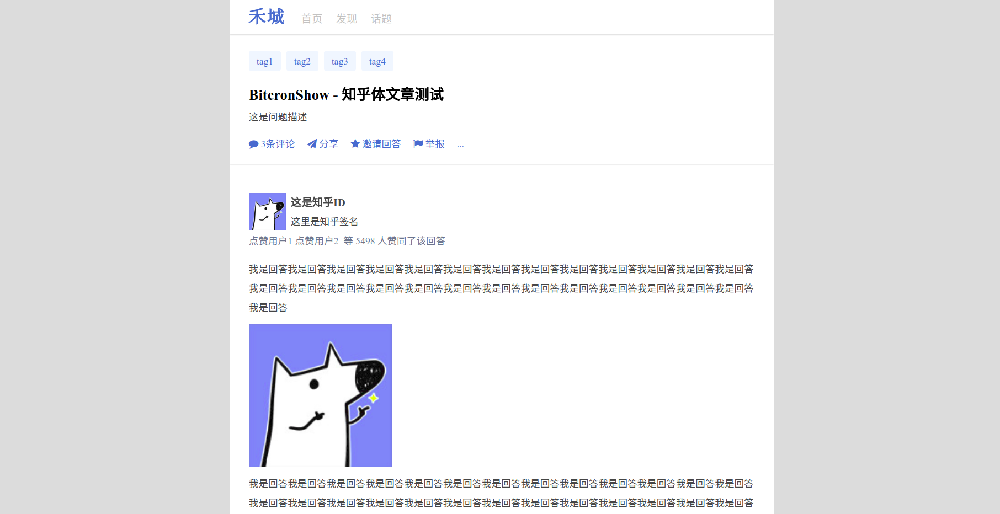

# bitcron快捷模板：知乎体

> 本意是拿来写知乎体同人的板子，后来发现给大家拿来存自己的知乎答案也不错……

**注意：** 此模板使用需要自定义大量的`metadata`，大家按需填写哈～

## 效果图



## 使用方法

从[github地址](https://github.com/matrixk/bitcron-includes_show_template-zhihu/)下载模板文件

在自己的Bitcron根目录里，`template`文件夹下，把`show`文件夹放进去，然后检查一下`zhihu.jade`、`zhihu.scss`和`zhihu_icon.png`是不是都在

### 在文章内直接调用

如果需要在文章内直接调用，在文章里写下如下语句：

参考[在 Markdown 中引入快捷模板](https://pi.bitcron.com/post/markdown/includes_show_template)

> \`\`\`code
> +h.show("zhihu")
> \`\`\`


就可以啦！

不过这种直接调用的方法不是太好……

### 作为模板的拓展

在你原本的`template`文件夹中找到`post.jade`文件夹，然后在最开头加上一段：

```jade
if post.metadata.genre in ['zhihu']
  +h.show("zhihu")
else
  [你原本的模板代码]
```

**重要！！！** 在加上开头三行以后，你原来`post.jade`里面的代码都要加上两个空格的缩进！注意！是每一行！

所以建议大家，先复制自己的`post.jade`里面的代码到记事本里，然后给 **每一行** 的段首都加上两个空格（哪怕是用Word替换功能也好，把段落符替换成段落符+两个空格……还不知道怎么做的问百度）以后，在最前面复制粘贴上面的前三行代码，最后把改动完毕的文档替换自己的`post.jade`里。

然后就可以在你的文档里通过`metadata`来使用这个模板啦！

## 文档内怎么使用这个模板

在文章的`meta`部分填上下面的自定义部分就好啦！

### genre

文体，需要调用模板的时候填“zhihu”，用于加载模板

*这条metadata可以自定义，比如改成`zhihu: true`什么的，不过那样的话上面的`post.jade`中的判断句要跟着改哦*

### title

你的文章题目，就是知乎的问题部分的标题

### zhihu_tags

问题标签，展示在问题题目上方的那个。

**重要：** 哪怕只有一个！也必须用list形式来写！也就是这样：

```
zhihu_tags:
 - tag1
 - tag2
```

### zhihu_quesdes

问题描述，最好不要太长，因为我没做超过多少字收起= =……

### zhihu_quescomments

**问题的评论数，不是你的回答的评论数！** 可以不填，不填显示为0

请只填一个数字，不要带单位

### zhihu_id

回答人的知乎用户名

### zhihu_idinfo

回答人的知乎签名，就是那个“凭本事挖坑为什么要填！”一类的……“XX类问题优秀回答者”也可以……

### zhihu_icon

你的知乎头像，请填一个url，外链也可以，站内链接也可以，总之就是跟你平时插入图片的时候一样一样的那个地址

外链请带`http`开头

如果不填，显示默认头像

### zhihu_likes

点赞数，**必须填！** 我没写默认值！

请只填一个数字，不要带单位

### zhihu_likesyou

谁谁谁赞了你，一般是你的关注人赞了你会看到这个，可以不填，不填就没有“某某某 等”，只有“多少多少人 赞同了该回答”

**哪怕只有一个，也必须是列表形式！**

### zhihu_date

自定义答案发表时间，如果没填会写上你的博文发布时间

### zhihu_link

**写知乎体同人的同志请！不！要！填这个**

在页面下方的一个外链，拿来存档自己回答的可以填上自己的知乎答案的网址，以`http`开头

……那个，让同志们不要填这个的意思不是在这项后面空着，而是直接删掉这一项Orz记住了哈

### 正文部分

正文部分请直接写答案，就按一般的Markdown文章的写法就可以了

## 示范文章

[示范文章：BitcronShow - 知乎体文章测试](https://matrixk.me/post/zi-zhi/2017-11-02)

这篇文章的文本是这样的：

```
---
Title: BitcronShow - 知乎体文章测试
Date: 2017-11-02 16:57:36
genre: zhihu
zhihu_tags:
 - tag1
 - tag2
 - tag3
 - tag4
zhihu_quesdes: 这是问题描述
zhihu_quescomments: 3
zhihu_id: 这是知乎ID
zhihu_idinfo: 这里是知乎签名
zhihu_likes: 5498
zhihu_likesyou:
 - 点赞用户1
 - 点赞用户2
zhihu_icon: /template/show/zhihu_icon.png
zhihu_date: 2017-10-10 17:05:25
zhihu_link: www.zhihu.com
---

我是回答我是回答我是回答我是回答我是回答我是回答我是回答我是回答我是回答我是回答我是回答我是回答我是回答我是回答我是回答我是回答我是回答我是回答我是回答我是回答我是回答我是回答我是回答我是回答我是回答我是回答我是回答


我是回答我是回答我是回答我是回答我是回答我是回答我是回答我是回答我是回答我是回答我是回答我是回答我是回答我是回答我是回答我是回答我是回答我是回答我是回答我是回答我是回答我是回答我是回答我是回答我是回答我是回答我是回答我是回答我是回答我是回答我是回答我是回答我是回答我是回答**我是回答我是回答我是回答**我是回答我是回答我是回答我是回答我是回答我是回答我是回答我是回答我是回答我是回答

[我是回答我是回答我是回答]

我是回答*我是回答我是回答我是回答我是回答我是回答我是回答*我是回答我是回答

我是回答我是回答我是回答我是回答我是回答我是回答我是回答我是回答我是回答我是回答我是回答[我是回答](https://matrixk.me/)我是回答我是回答我是回答我是回答我是回答我是回答我是回答我是回答我是回答我是回答我是回答我是回答我是回答

> 我是回答我是回答我是回答我是回答我是回答我是回答我是回答我是回答我是回答我是回答我是回答我是回答我是回答我是回答我是回答我是回答我是回答我是回答我是回答我是回答

1. 我是回答
2. 我是回答我是回答
3. 我是回答我是回答我是回答我是回答我是回答我是回答我是回答
4. 我是回答我是回答我是回答我是回答我是回答我是回答我是回答

- 我是回答我是回答
- 我是回答我是回答
- 我是回答我是回答我是回答我是回答我是回答

```
